# KnownUser.V3.Akamai
## Introduction
There are 3 options for Akamai integration:
1.	Manually updating integration config within Edge worker code
1.	Dynamically download and cache integration config
1.	Push integration config to Akamai EdgeKV
Akamai integration should be implemented in phases starting with the easiest option (manual updating) and progressing to more advanced integration options once the previous option has been completed and tested successfully.
## GO Integration Steps
First, prepare for the integration in GO:
1.	Create desired waiting room(s), triggers, and actions in GO. 
1.	Publish the configuration from the Integrations Overview page
1.	Download the configuration (**`customerid_knownuser_integration_config.json`**)
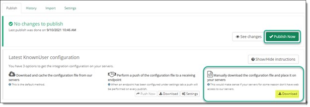 
## Akamai Integration – Manual Update Option
Next, add Akamai integration, starting with the manual option. There are 3 steps to completing the Akamai integration.
1.	Create an EdgeWorker ID
1.	Create Property Variables
1.	Create PM Rules
### Create EdgeWorker ID
1.	Download **QueueITAkamaiEdgeConnector.tgz** from [github.com/queueit](https://github.com/queueit)
1.	Go to EdgeWorkers Management page on Akamai Control Center
    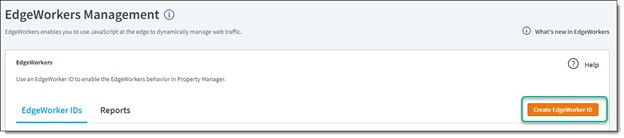

1.	Click **Create EdgeWorker ID**
    *	Give your Edgeworker ID a name
    *	Select a Group
    *	Select Resource tier of **Dynamic Compute**
    *	Click **Create EdgeWorker ID**

    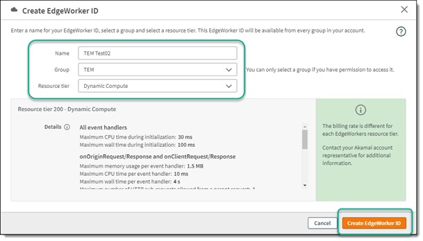

4.	Select your new EdgeWorker ID from the list on the next page
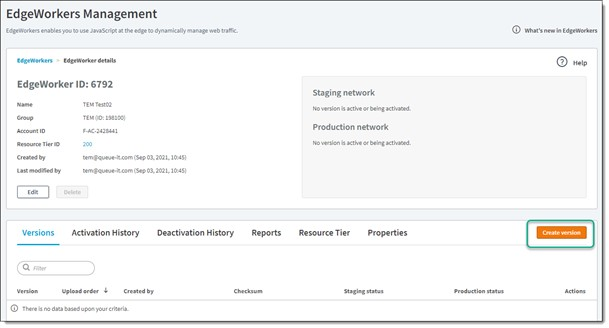 

1.	Click Create Version
1.	On the Create Version window, 
1.	Select the **`QueueITAkamaiEdgeConnector.tgz`** bundle you downloaded from github
1.	You should see a message that the bundle file is valid

    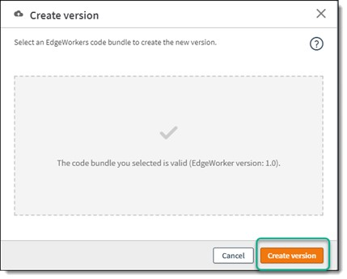
 
9.	Click **Create version** to upload the bundle
10.	You should see your new version listed

    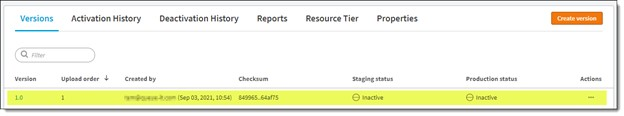

11.	Select the new version 1.0 and then select the **Code Bundle** tab
12.	You should see all the files contained in the uploaded bundle (as shown below)

    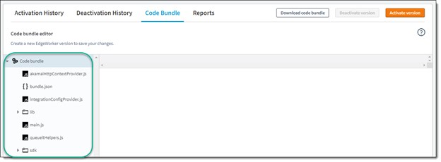
 
13.	Select **`bundle.json`** and increment the edgeworker-version (ie from 1.0 to 1.1)

    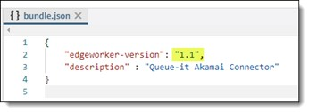
 
14.	Select **`integrationConfigProvider.js`** and replace the text within the quotes with the contents of the json file downloaded from GO.

    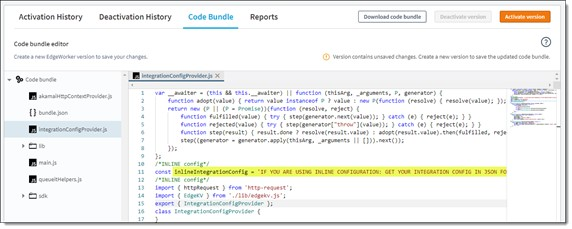

15.	After updates are complete, **Save as new version**
 
    

16.	**Activate version** and wait for activation to complete (5-10 min in staging)
 
    

### Create Property Variables
There are 4 Property Variables used by the Queue-it EdgeWorker to support all the different integration methods.  The **CONFIG_TYPE** variable controls the integration method used and be set to any of 3 values: inline, cache, and edgekv.  See the Description field in the screenshot below for guidance on initial value assignment.

1.	Add the following Property Variables to the property:
    *	`PMUSER_QUEUEIT_CUSTOMERID`
    *	`PMUSER_QUEUEIT_SECRET_KEY`
    *	`PMUSER_QUEUEIT_CONFIG_TYPE` – set to “inline”
    *	`PMUSER_QUEUEIT_API_KEY`

    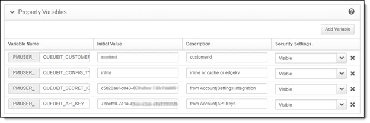

### Create PM Rules
There are 2 PM rules needed to support manual integration updating. 

1.	Create the **EdgeWorker** rule
    * Add criteria of “Path” “does not match one of” 
        * With value of:  **`/queueit/integrationconfig/`**
    * Add criteria of “File Extension” “is not one of”
        * With the values below

        **`aif aiff au avi vin vmp cab carb cct cdf class doc dcr dtd exe flv gcf gff gif grv hdml hqx ico ini jpeg jpg mov mp2 nc pct pdf png ppc pws swa swf txt vbs w32 wav wbmp wmf wmlc wmls wmlsc xsd zip pict tif tiff mid midi ttf eot woff woff2 otf svg svgz webp jxr jar jp2 css js`**

        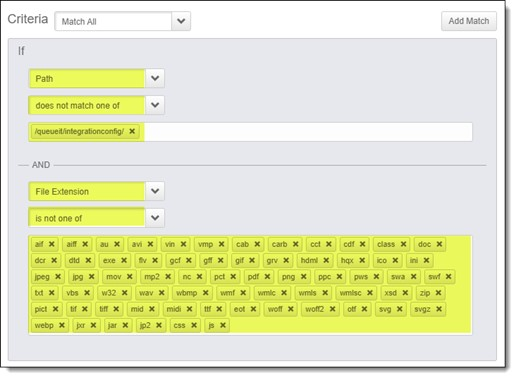

    * Add behavior of **EdgeWorkers** and select your newly created EdgeWorker ID
    * **Save** the new rule

        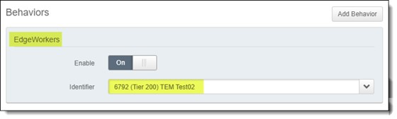

2.	Create the **EdgeWorkerRetry** rule
    * Add a new child rule to the previously created EdgeWorker rule
    * Add criteria of “**EdgeWorkers Execution Status**” matches **Failure**
    * Add behavior of “**Use alternate hostname in this property**” with the following values: 
        * Alternate Hostname: **`{{builtin.AK_HOST}}`**
        * Modify Request Path: **No**
    * Save the new rule

        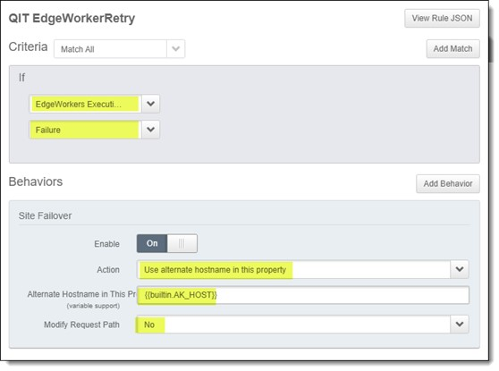

3.	Active new Property version in staging or production

    
 
## Akamai Integration – Dynamic Download/Cache Option
After completing and successfully testing the manual update integration option, there are 2 additional steps required to implement the dynamic download integration option.
1.	Update the CONFIG_TYPE Property Variable 
1.	Create a new PM Rule for integration configuration download
1.	Activate new PM Rule

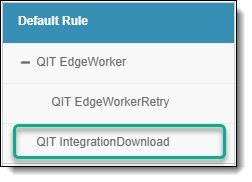

### Update CONFIG_TYPE Property Variable
* Update the value from **`inline`** to **`cache`**.

    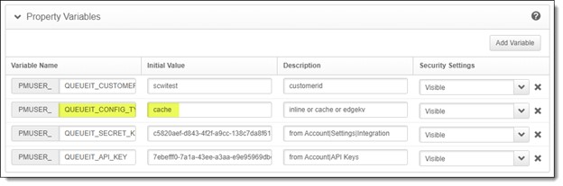

### Create IntegrationDownload Rule
* Add a new rule below the previously created EdgeWorker rule (not a child)
* Add criteria of “Path” with operator of “matches one of”
    * Set the match value to **`/queueit/integrationconfig/`**

    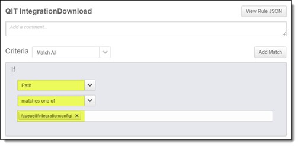 

* Add behavior of “**Origin Server**” with the following values:
    * Origin Server Hostname: **[your queue domain]** ie acme.queue-it.net
    * Forward Host Header: **Custom Value**
    * Custom Forward Host Header: [**your queue domain**]
* Add behavior of “**Modify Outgoing Request Path**” with the following values:
    * Find what: **`/queueit/integrationconfig/`**
    * Replace with: **`/status/integrationconfig/secure/customerid/`**
* Add behavior of “**Caching**” with the following values:
    * Maxage: **5 minutes**
* Add behavior of “**Cache Prefreshing**” with default values:
* **Save** the new rule

     

    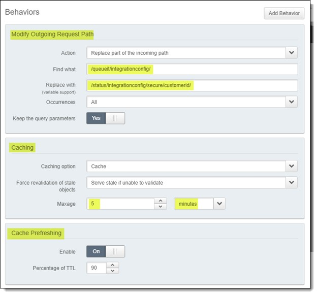 
 
### Activate new Property version in staging or production
      


## Protecting AJAX calls
If you need to protect AJAX calls beside page loads, you need to add the below JavaScript tags to your pages:
```
<script src="//static.queue-it.net/script/queueclient.min.js"></script>
<script
  data-queueit-spa=”true”
  data-queueit-intercept-domain="{**YOUR_API_DOMAIN**}"
  data-queueit-intercept="true"
  data-queueit-c="{**YOUR_CUSTOMER_ID**}"
  src="//static.queue-it.net/script/queueconfigloader.min.js">
</script>
```
After placing this snippet on the AJAX caller page, when the Queue-it connector intercepts the AJAX call (it will if the API domain/path is protected), it will return a 200 (with some Queue-it header extras) instead of a 302 which would break the call.  The javascript snippet will intercept the header extras in the AJAX response and handle a redirection to the queue page if required (missing or expired QueueITAccepted cookie)
